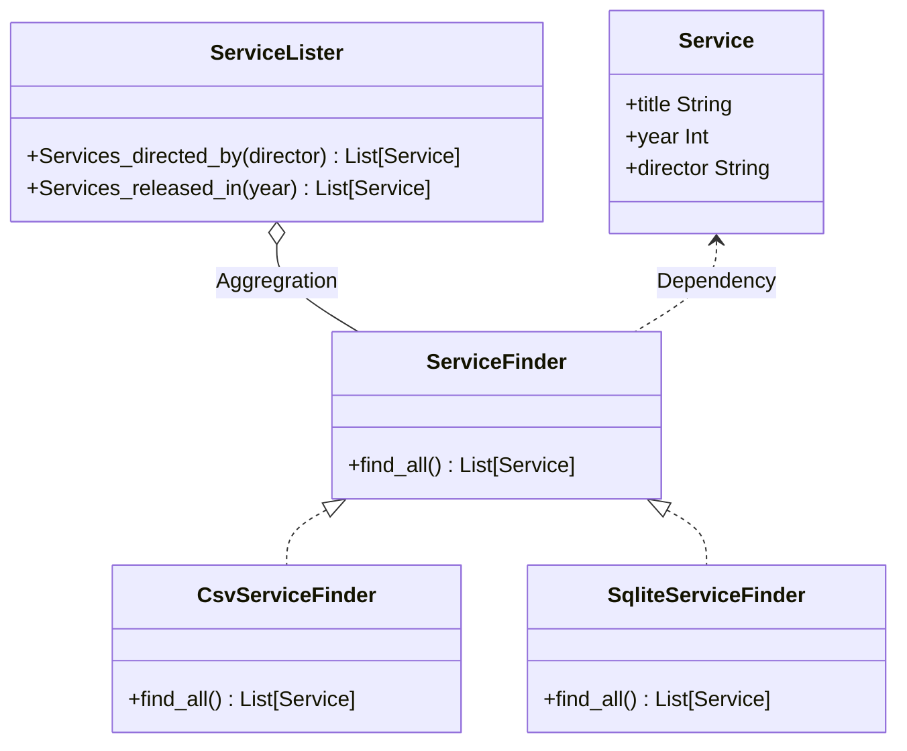

# Make project with poetry
Poetry로 구축한 환경에서 CLI만들기 연습

## Target system class diagram 

```mermaid
classDiagram
	class ServiceLister
		ServiceLister : +Services_directed_by(director) List[Service]
		ServiceLister : +Services_released_in(year) List[Service]
	
	class ServiceFinder
		ServiceFinder: +find_all() List[Service]
	
	class Service
		Service: +title String
		Service: +year Int
		Service: +director String
		
	class CsvServiceFinder
		CsvServiceFinder: +find_all() List[Service]
	
	class SqliteServiceFinder
		SqliteServiceFinder: +find_all() List[Service]
		
	ServiceLister o-- ServiceFinder: Aggregration 
	Service <.. ServiceFinder: Dependency
	ServiceFinder <|..CsvServiceFinder 
	ServiceFinder <|.. SqliteServiceFinder 
```