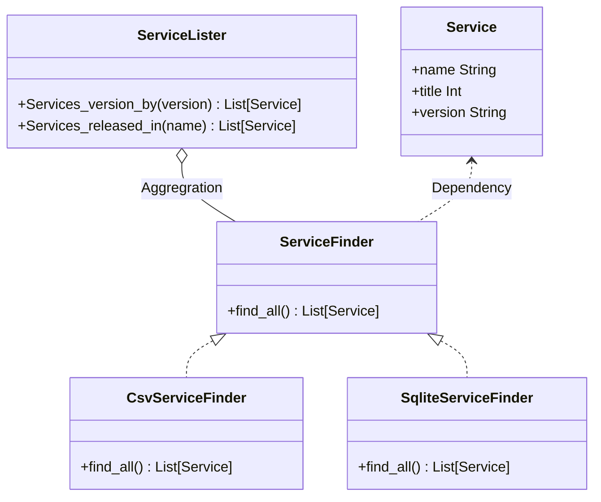

# Make project with poetry
Poetry로 구축한 환경에서 CLI만들기 연습

## Pre-requirement
설치하고 싶으면 [링크](https://gist.github.com/1eedaegon/cc23648cd2f92331c3f748be9cac4f03) 참고
- python3
- poetry

## Initialize project
```bash
> poetry init
```

## Run
```bash
> python -m py_env_dev_practice
```

## Generate database files
```bash
> poetry run fixture
```

## Test
```bash
> poetry run pytest --cov=services         
============================================= test session starts ==============================================
platform linux -- Python 3.9.1, pytest-7.1.2, pluggy-1.0.0
rootdir: /home/lee/workspace/python/py-dev-env-practice
plugins: cov-3.0.0
collected 2 items                                                                                              

tests/test_py_dev_env_practice.py .F                                                                     [100%]/home/lee/workspace/python/py-dev-env-practice/.venv/lib/python3.9/site-packages/coverage/inorout.py:519: CoverageWarning: Module services was never imported. (module-not-imported)
  self.warn(f"Module {pkg} was never imported.", slug="module-not-imported")
/home/lee/workspace/python/py-dev-env-practice/.venv/lib/python3.9/site-packages/coverage/control.py:794: CoverageWarning: No data was collected. (no-data-collected)
  self._warn("No data was collected.", slug="no-data-collected")
WARNING: Failed to generate report: No data to report.

/home/lee/workspace/python/py-dev-env-practice/.venv/lib/python3.9/site-packages/pytest_cov/plugin.py:294: CovReportWarning: Failed to generate report: No data to report.

  self.cov_controller.finish()


=================================================== FAILURES ===================================================
__________________________________________ test_services_released_in ___________________________________________

container = <dependency_injector.containers.DynamicContainer object at 0x7f1ca9fa6f40>

    def test_services_released_in(container):
        finder_mock = mock.Mock()
        finder_mock.find_all.return_value = [
            container.service("Proxy service", 20220617, "v1.1.1"),
            container.service("Load balancer service", 20220617, "v2.1.2"),
        ]
        with container.finder.override(finder_mock):
            lister = container.lister()
            services = lister.service_released_in(20220617)
    
>       assert len(services) != 2
E       AssertionError: assert 2 != 2
E        +  where 2 = len([Service(name='Proxy service', timestamp=20220617, version='v1.1.1', Service(name='Load balancer service', timestamp=20220617, version='v2.1.2'])

tests/test_py_dev_env_practice.py:52: AssertionError

----------- coverage: platform linux, python 3.9.1-final-0 -----------

=========================================== short test summary info ============================================
FAILED tests/test_py_dev_env_practice.py::test_services_released_in - AssertionError: assert 2 != 2
========================================= 1 failed, 1 passed in 0.18s =========================================
```

## Target system class diagram 
